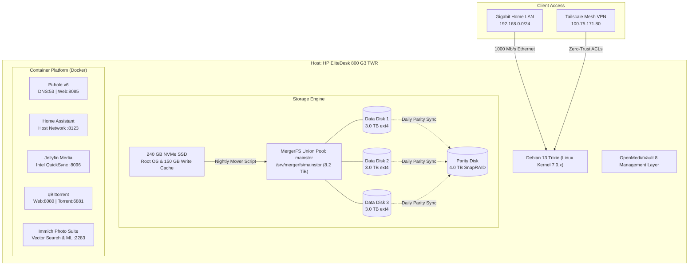
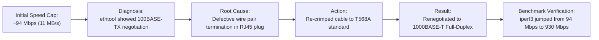
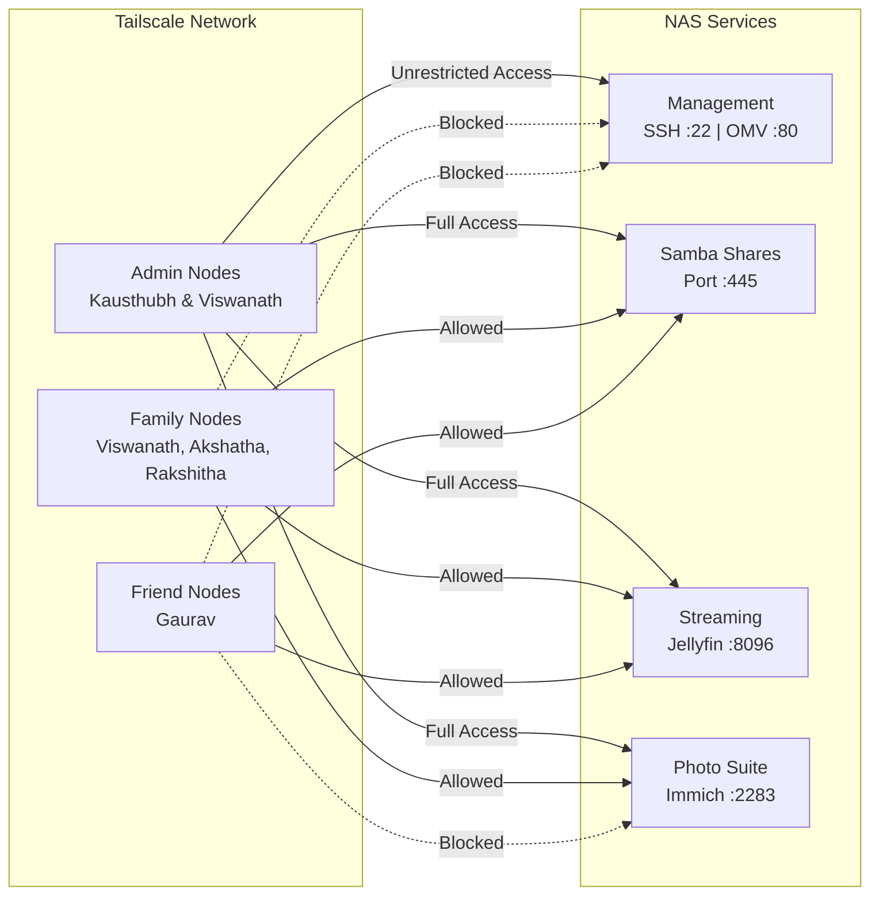
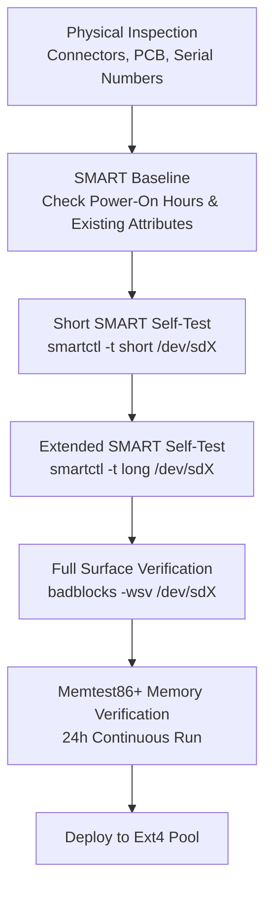

# AVK-Vault: Enterprise-Grade DIY Home NAS & Server

[-A81D33.svg?logo=debian)](https://www.debian.org/)
[](https://www.openmediavault.org/)
[](#storage-subsystem--drive-architecture)
[-blue.svg)](#hardware-specification)
[](#physical-network-troubleshooting-gigabit-upgrade)
[](https://tailscale.com/)

A comprehensive architectural blueprint, hardware specification, and operational playbook for the **`AVK-Vault`** DIY Network-Attached Storage (NAS) and home server. 

Built on a refurbished enterprise desktop platform for ~₹20,000, this system provides **8.2 TiB of pooled data storage**, snapshot parity protection, an NVMe-backed write cache, local DNS ad-blocking, smart home automation, high-performance photo management, and hardware-accelerated media streaming without vendor lock-in.

---

## Architecture Overview



---

## Hardware Specification

The build repurposes an enterprise business desktop, selected for its balance of power efficiency, low acoustic profile, native SATA expandability, and integrated graphics transcoding capability:

| Component | Specification | Operational Role / Details |
| :--- | :--- | :--- |
| **Chassis & Board** | HP EliteDesk 800 G3 Tower (TWR) | Enterprise tool-less chassis with multi-drive 3.5" internal bay clearance |
| **Processor (CPU)** | Intel Core i5-7500 @ 3.40 GHz (4C / 4T) | 65W TDP; integrated Intel HD Graphics 630 with QuickSync (`/dev/dri`) |
| **Memory (RAM)** | 16 GB DDR4-2400 | ~10 GB dynamically allocated for Linux kernel page cache and buffers |
| **Boot Drive** | 240 GB Lite-On NVMe SSD (`0020113000WH`) | Hosts EFI, Debian root (`/`), Docker metadata, and 150 GB `/cache.img` |
| **Data Drives** | 3× 3.0 TB HP Enterprise SATA HDDs | Formatted as native `ext4` with quota support (`usrquota,grpquota`) |
| **Parity Drive** | 1× 4.0 TB HP Enterprise SATA HDD | Dedicated to SnapRAID parity (`snapraid.parity`) |
| **Network (NIC)** | Intel I219-LM Gigabit Ethernet (`eno1`) | 1000BASE-T full-duplex wired LAN connection |
| **Thermal Profile** | 27°C – 34°C across all spinning drives | 0 reallocated sectors across all disks via monitored SMART attributes |

---

## Storage Subsystem & Drive Architecture

Rather than traditional hardware RAID or rigid ZFS vdev striping, the storage subsystem pairs **MergerFS** with **SnapRAID** to maximize JBOD flexibility, energy efficiency, and data safety.

```
               ┌───────────────────────────────────────────────────────────┐
               │              MergerFS Union Pool: mainstor                │
               │            Mount: /srv/mergerfs/mainstor (8.2 TB)         │
               └─────────────────────────────┬─────────────────────────────┘
                                             │
               ┌─────────────────────────────┼─────────────────────────────┐
               │                             │                             │
    ┌──────────▼───────────┐      ┌──────────▼───────────┐      ┌──────────▼───────────┐
    │     Data Disk 1      │      │     Data Disk 2      │      │     Data Disk 3      │
    │  3.0 TB HP Enterprise│      │  3.0 TB HP Enterprise│      │  3.0 TB HP Enterprise│
    │   /dev/sdb1 (ext4)   │      │   /dev/sda1 (ext4)   │      │   /dev/sdc1 (ext4)   │
    └──────────┬───────────┘      └──────────┬───────────┘      └──────────┬───────────┘
               │                             │                             │
               └─────────────────────────────┼─────────────────────────────┘
                                             │ Protected by Snapshot Parity
                                  ┌──────────▼───────────┐
                                  │     Parity Disk      │
                                  │  4.0 TB HP Enterprise│
                                  │   /dev/sdd1 (ext4)   │
                                  │  (snapraid.parity)   │
                                  └──────────────────────┘
```

### Architectural Decisions

1. **Independent Ext4 Filesystems**:
   - Each data drive runs an ordinary, self-contained `ext4` filesystem.
   - If two or more drives experience catastrophic physical failure simultaneously, **only the data on those specific drives is lost**. The remaining surviving drives can be plugged into any standard Linux system and read immediately.
2. **Drive Spin-Down & Power Conservation**:
   - In traditional striped arrays (RAID5/6/ZFS), every disk must spin up for any file read.
   - With MergerFS, only the specific HDD hosting the requested file spins up; all other drives remain in low-power standby.
3. **Parity Sizing Requirement**:
   - SnapRAID requires the parity disk to be equal to or larger than the largest single data disk. 
   - The 4.0 TB parity disk (`/dev/sdd1`) fully covers the 3.0 TB data disks, providing a clean path for future 4.0 TB drive expansion.
4. **NVMe Write Cache & Automated Mover**:
   - High-speed incoming network writes land on a 150 GB loop image (`/cache.img`) mounted at `/mnt/cache` on the NVMe SSD.
   - An automated background mover script (`/usr/local/bin/mover.sh`) runs via cron, transferring buffered files to whichever underlying HDD has the most free space using `rsync -aXR --remove-source-files`.
5. **SnapRAID Automated Sync & Delete Guard**:
   - Scheduled daily at 3:00 AM via `/usr/local/bin/snapraid-auto-sync.sh`.
   - **Delete Guard Safety Abort**: Before committing parity updates, the script counts deleted files. If more than **500 files** were deleted since the last run, the sync automatically aborts and alerts the administrator. This prevents accidental user deletions, ransomware, or an unmounted disk from wiping parity protection.
   - **Scrubbing**: Automatically performs an incremental 12% block scrub on every cycle to detect silent bit rot.

---

## Physical Network Troubleshooting: The Gigabit Upgrade

During initial deployment, network file transfers between the client workstation (`kblade`) and the NAS were mysteriously capped at ~94 Mbps (~11 MB/s):



* **Diagnosis**: Running `ethtool eno1` revealed the NIC had down-negotiated to 100BASE-TX full-duplex because of an open pair in the hand-made Ethernet cable.
* **Correction**: The cable was stripped, re-aligned, and re-crimped to the **TIA/EIA T568A standard**.
* **Result**: The link immediately established at **1000 Mb/s (Gigabit)** full-duplex. Live `iperf3` throughput benchmarks rose from **94 Mbps to 930 Mbps** (~115 MB/s wire speed), unlocking full line-rate saturation for Samba transfers.

---

## Zero-Trust Remote Access: Tailscale Mesh VPN

Remote access is handled via Tailscale, avoiding public port forwarding on the home router. Access control is enforced via a least-privilege Tailscale ACL policy:



* **Admins (`Kausthubh`, `Viswanath`)**: Unrestricted administrative access across SSH (`22`), OMV UI (`80`), Docker engine, and all internal ports.
* **Family (`Viswanath`, `Akshatha`, `Rakshitha`)**: Access restricted to SMB File Shares (`445`), Jellyfin (`8096`), and Immich Photos (`2283`).
* **Friends (`Gaurav`)**: Strictly limited to SMB (`445`) and Jellyfin (`8096`); access to Immich photos and admin ports is completely blocked.
* **LAN Gaming Exemption**: Incoming ports opened on workstation `kblade` allowing friends on the Tailnet to join locally hosted Minecraft servers (`100.102.208.110:25565`).

---

## User Governance, Shares & Storage Quotas

OpenMediaVault manages native Linux system users, POSIX permissions, and Samba (`smbd`) shares with macOS Apple extensions (`fruit:aapl`) and network recycle bins (`.recycle`):

### Quota Allocations
Filesystem-level `ext4` quotas are applied across the underlying pool disks:
* **Gaurav**: Hard quota of **128 GB** (`134217728` KB) and soft limit of 120 GB.
* **Family Members (`Kausthubh`, `Viswanath`, `Akshatha`, `Rakshitha`)**: Unlimited pool storage.

### Samba Share Structure
* `kaust`: Private personal share for Kausthubh.
* `Family`: Shared family directory accessible by Kausthubh, Viswanath, and Akshatha.
* `Friends`: Shared folder for friends (Kausthubh, Gaurav, Rakshitha).
* `vishu`, `akshatha`, `Gaurav`, `raks`: Private individual home shares.
* `jellyfin` & `torrents`: Dedicated media ingest and download directories.

---

## Container Platform & Docker Inventory

All microservices are organized under `/opt/<service>` and orchestrated using Docker Compose with non-root runtime permissions (`PUID=1000`, `PGID=100`):

| Service | Port / Access | Container Image | Architecture & Role |
| :--- | :--- | :--- | :--- |
| **OpenMediaVault** | `http://192.168.0.10:80` | Bare-metal | Web-based storage management, drive health, and Samba control |
| **Pi-hole v6** | `http://192.168.0.10:8085/admin`<br/>DNS: `53/udp`, `53/tcp` | `pihole/pihole:latest` | Network-wide ad & tracker blocking DNS server. Configured with `listeningMode: ALL` |
| **Home Assistant** | `http://192.168.0.10:8123` | `home-assistant:stable` | Smart home automation running on `network_mode: host` for native mDNS discovery and `/run/dbus` Bluetooth |
| **Jellyfin** | `http://192.168.0.10:8096` | `linuxserver/jellyfin` | Media streaming engine with Intel QuickSync GPU pass-through (`/dev/dri`) |
| **qBittorrent** | `http://192.168.0.10:8080`<br/>Torrent: `6881` | `linuxserver/qbittorrent` | Automated BitTorrent ingest client |
| **Immich Server** | `http://192.168.0.10:2283` | `immich-app/immich-server:v2` | Self-hosted photo and video backup platform |
| ↳ *PostgreSQL* | Internal (`5432`) | `postgres:14-vectorchord` | Relational database with vector extension for image embeddings |
| ↳ *Machine Learning* | Internal | `immich-machine-learning:v2` | Facial recognition, facial clustering, and CLIP semantic search |
| ↳ *Redis Cache* | Internal (`6379`) | `valkey/valkey:9` | High-performance job queue and session caching |

### DNS Port 53 Conflict Resolution
During Pi-hole deployment, port 53 was already occupied by systemd's local stub resolver (`127.0.0.53:53`). 
* Safely resolved by disabling `DNSStubListener=no` in `/etc/systemd/resolved.conf`.
* Symlinked `/run/systemd/resolve/resolv.conf` to `/etc/resolv.conf`.
* Allowed Pi-hole to cleanly bind to `0.0.0.0:53`.
* Router DHCP was updated: Primary DNS set to `192.168.0.10`, secondary DNS left blank (preventing fallback ad leakage), and DHCP scope set to `192.168.0.25`–`192.168.0.254` to protect the static reservation at `.10`.

---

## Media Automation & Atomic Hardlinks

The automated media pipeline between qBittorrent and Jellyfin operates with **zero duplicate disk usage**:

* Both `/srv/mergerfs/mainstor/torrents` and `/srv/mergerfs/mainstor/jellyfin` reside within the same MergerFS union mount.
* Atomic hardlinks were verified:
  ```bash
  stat -c "device: %d inode: %i" /srv/mergerfs/mainstor/torrents/test.mkv
  stat -c "device: %d inode: %i" /srv/mergerfs/mainstor/jellyfin/Movies/test.mkv
  ```
  Both files return the **identical device ID (`50`) and inode (`675615427769144811`)**.
* Media managers (Sonarr/Radarr) hardlink downloaded media directly into Jellyfin libraries instantaneously. Files continue seeding in qBittorrent indefinitely without consuming double disk space.

---

## Protocol Evaluation: NFS vs. Samba

An operational trial was conducted to evaluate whether NFSv4 offered measurable advantages over Samba for Linux desktop clients:
* Exports were created using OMV's internal RPC engine with unique filesystem IDs (`fsid`) to support MergerFS underlying paths.
* While NFS functioned correctly, managing concurrent permissions across macOS, Windows, and Linux clients introduced unnecessary administrative overhead.
* The NFS exports were cleanly unmounted and disabled, consolidating all file sharing onto Samba (CIFS) for unified ACL enforcement, recycle bin protection, and client compatibility.

---

## Acceptance Testing & Drive Vetting Playbook

Before any drive was introduced to the storage pool, it completed a rigorous drive vetting pipeline to eliminate infant mortality and identify marginal hardware:



### Key SMART Telemetry Tracked
* **Reallocated Sector Count** (`ID 5`): Must be strictly `0`.
* **Current Pending Sector Count** (`ID 197`): Must be strictly `0`.
* **Offline Uncorrectable Sector Count** (`ID 198`): Must be strictly `0`.
* **UDMA CRC Error Count** (`ID 199`): Checked to verify SATA cable and backplane signal integrity.

---

## Project Structure

```text
AVK-Vault-NAS/
├── timeline_antigravity.txt      # Execution, network debugging, and container setup log
├── timeline_chatgpt.txt          # Hardware vetting, architecture analysis, and build criteria
├── .gitignore                    # Git ignore rules
└── README.md                     # Complete system architecture and operational documentation
```

---

## License

Personal home server architecture and documentation. Configured and documented by Kausthubh Viswanath.
